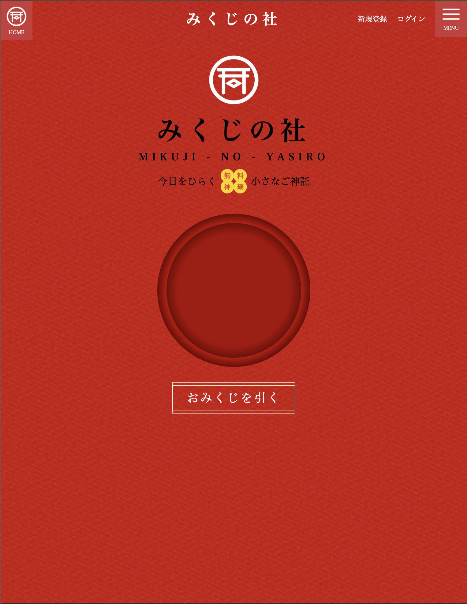
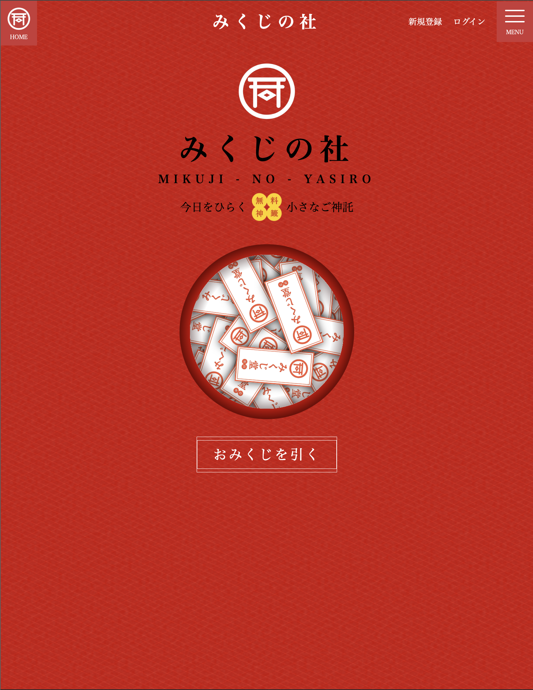
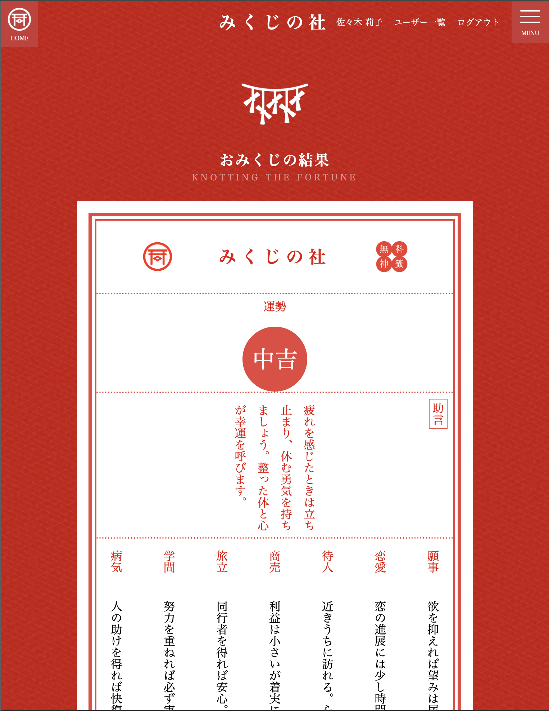
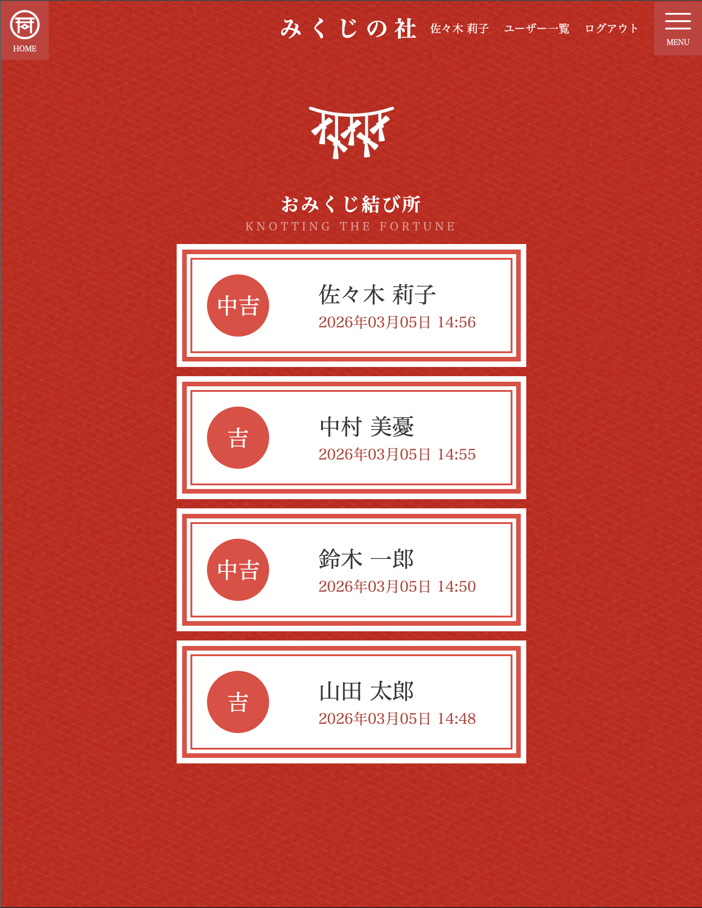

# Omikuji App

Railsで作成したオンラインおみくじアプリです。  
おみくじをランダム生成し、結果をデータベースに保存して履歴として確認できます。

---

## App URL

https://omikuji-app-9uan.onrender.com

---

## ScreenShot

### Topページ（初期表示）

おみくじを引く前の状態

### Topページ（アニメーション後）

Stimulusを使用しておみくじの札がランダムに生成されるアニメーションを実装

### おみくじ結果ページ

### おみくじ履歴ページ

---

## 主な機能

- ユーザー登録 / ログイン
- おみくじのランダム生成
- おみくじ結果の表示
- おみくじ結果の保存
- おみくじ履歴一覧
- おみくじ詳細表示
- おみくじ削除機能
- 未ログインユーザーは「名無し」として保存

---

## 使用技術

### Backend
- Ruby
- Ruby on Rails

### Frontend
- HTML
- CSS
- JavaScript
- Stimulus

### Database
- SQLite

### Deploy
- Render

---

## データベース設計

### Users

| column | type |
|------|------|
| id | integer |
| name | string |
| email | string |
| password | string |

### Omikujis

| column | type |
|------|------|
| id | integer |
| fortune | string |
| advice | text |
| wish | string |
| love | string |
| visitor | string |
| business | string |
| travel | string |
| study | string |
| illness | string |
| user_id | integer |

Users と Omikujis を **user_id** で関連付けています。

---

## 工夫した点

- おみくじ結果をデータベースに保存し履歴として確認できるようにした
- UserモデルとOmikujiモデルを user_id で関連付けた
- メールアドレスの重複登録を防ぐバリデーションを実装
- 未ログインユーザーでも利用できるよう「名無し」として記録する仕様にした

---

## 苦労した点

Turboのprefetch機能により意図せず `GET /result` が実行されDBにデータが保存される問題が発生したため、`data-turbo-prefetch="false"` を設定して解決し、GETリクエストで副作用を起こさないREST設計の重要性を学びました。

---

## 今後追加予定の機能

- 1日1回のおみくじ制限
- SNSシェア機能
- UI / デザイン改善

---

## Author

Shoma Kaji